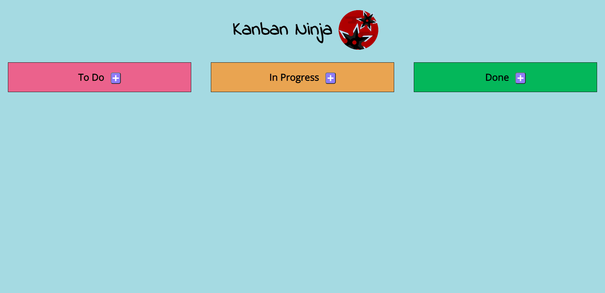

# Kanban Board

---
## Overview

A react project using `react-beautiful-dnd` to achieve a drag and drop effect. I wanted to build somthing a bit more interesting and complex than a simple to-do list. The `react-beautiful-dnd` package didn't work strait away but there is some good documentation online and I googled my way through it. 

---
## features

I wanted to create a fully interactive kanban board. I had to be able to: 

- Add a task to any of the columns
- Re-order tasks within the columns
- Move tasks between columns
- Delete tasks with a warning including the task name

---
## Dependencies 

- React Beautiful DND
- Font Awesome

---
## Demo

See the live site [here](https://johnpalmgren.github.io/kanban-board/) 

---
## Contact

- [Website](http://johnpalmgren.co.uk/)
- [Github](https://github.com/JohnPalmgren)
- [Twitter](https://twitter.com/john_palmgren)
